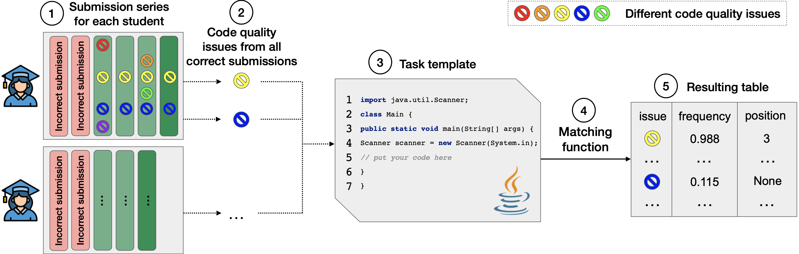

# Searching code quality errors in the task templates

This module allows running the algorithm of searching code quality errors in the task templates and analyze its result.

## Searching algorithm

The algorithm pipeline is the following: 

The output file contains the following columns:

### Usage

Run the [search.py](search.py) script with the arguments from command line.

Required arguments:

- `submissions_path` — Path to .csv file with submissions. The file must contain the following columns: `id`, `step_id`, `code`, `group`, `attempt`, `raw_issues` (please, use [preprocess_submissions.py](../preprocessing/preprocess_submissions.py) script to get  `group` and `attempt` columns).
- `steps_path` — Path to .csv file with steps. The file must contain the following columns: `id`, `code_template`.
- `result_path` — Path to resulting .csv file with issues ranking.

Optional arguments:

Argument | Description
--- | ---
|**steps_with_groups_count**| Path to new .csv file with steps and counted number of groups. The resulted file will be equal to the initial `steps_path`, but with an additional column `groups_cnt`. The default value is `None`, it means the initial file `steps_path` will be rewritten.|
|**&#8209;N** | Number of top issues for every step. The default value is `50`.|
|**&#8209;equal** | Function for lines comparing. Possible functions: `char_by_char`, `edit_distance`. The default value is `char_by_char`.|

## Postprocessing

This script allows processing the results of the algorithm to convert into more user-friendly format:

First, we apply basic issues filtering by frequency, because if an issue is found in a small percentage of users,
it is most likely not an issue in the template and the students just don't want to fix it.
We have chosen 10% as such a threshold.
This threshold was chosen empirically.

If within the same task there are several same code quality issues, with different frequencies, but with the None position 
in the template, keep the most frequent of them.

The results of the algorithm are divided into several tables: 
- template errors (**Template** type, frequency of at least 51%)
- common typical errors (**Typical** type, frequency from 25% to 51%)
- rare typical errors (**Typical** type, frequency 10% to 25%)

Also, additional supporting information can be received:
for each task and each type of issue, random student solutions containing 
a given issue in a given task can be selected and saved.

### Usage

Run the [postprocessing.py](postprocessing.py) script with the arguments from command line.

Required arguments:

`templates_search_result` — Path to .csv file with issues in templates, that can be calculated on the previous step.
`result_path` — Path to resulting folder with processed issues.
`raw_issues_path` — Path to .csv file with raw issues. By default, it is `None`. If this argument is not `None`, the resulting file will contain the `description` column for each task and the students solutions will be gathered.

Optional arguments:

Argument | Description
--- | ---
|**&#8209;fd**, **&#8209;&#8209;filter-duplicates-type** | Function for union the same issues. Possible functions: `max`, `min`. The default value is `max`.|
|**&#8209;fk**, **&#8209;&#8209;freq-to-keep** | The threshold of frequency to keep issues in the final table. The default value is `51`.|
|**&#8209;fr**, **&#8209;&#8209;freq-to-remove** | The threshold of frequency to remove issues in the final table. The default value is `10`.|
|**&#8209;fs**, **&#8209;&#8209;freq-to-separate** | The threshold of frequency to separate issues into typical and template in the final table. The default value is `25`.|
|**&#8209;n**, **&#8209;&#8209;number-of-solutions** | Tne number of random students solutions that should be gathered for each task. The default value is `5`.|
|**&#8209;&#8209;add-description** | The argument determines whether the description of each issue should be added. The default value is `True`.|
|**&#8209;url**, **&#8209;&#8209;base-task-url** | Base url to the tasks on an education platform. The default value is `https://hyperskill.org/learn/step`.|

### Output file example

step_id | origin_class | frequency | pos_in_template | task_link | description 
--- | --- | --- | --- | --- | ---
2262|UselessParentheses|0.8195615514333895|<null>|LINK|Useless parentheses.
5203|IndentationCheck|0.6465067778936392|30, 33, 36|LINK|'method def modifier' has incorrect indentation level 5, expected level should be 4.