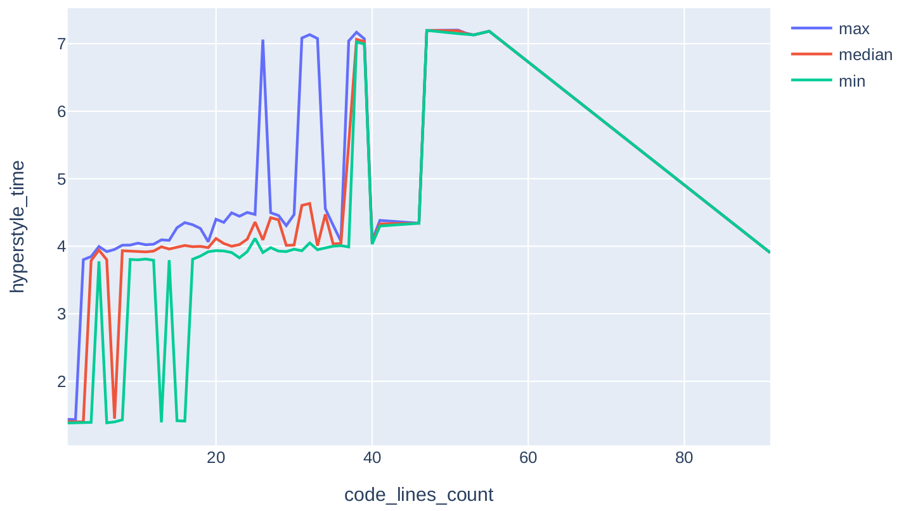
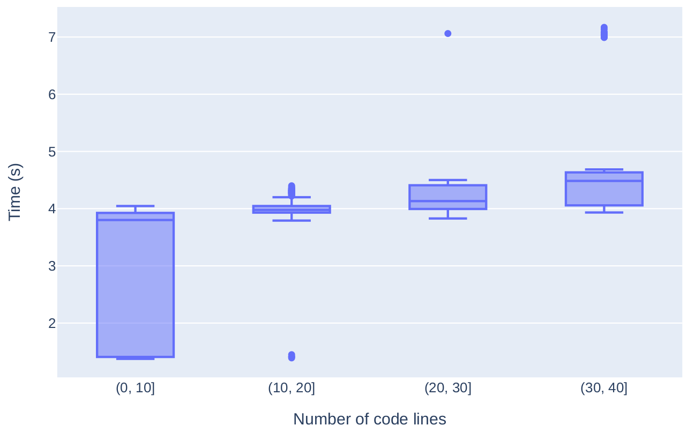

# Hyperstyle evaluation: plots
This module allows you to visualize the data.

Plotters:
- [Diffs plotter](#diffs-plotter)
- [Raw issues statistics plotter](#raw-issues-statistics-plotter)
- [Benchmark plotter](#benchmark-plotter)

## Diffs plotter
This script allows you to visualize a dataset obtained with [diffs_between_df.py](../inspectors/diffs_between_df.py). 

The script can build the following charts: 
* number of unique issues by category ([Example](#number-of-unique-issues-by-category))
* number of issues by category ([Example](#number-of-issues-by-category))
* number of unique penalty issues by category ([Example](#number-of-unique-penalty-issues-by-category))
* number of penalty issues by category ([Example](#number-of-penalty-issues-by-category))
* median penalty influence by category ([Example](#median-influence-on-penalty-by-category)) 
* distribution of penalty influence by category ([Example](#distribution-of-influence-on-penalty-by-category))

### Usage
Run the [diffs_plotter.py](diffs_plotter.py) with the arguments from command line.

**Required arguments**:
1. `diffs_file_path` — path to a file with serialized diffs that were founded by [diffs_between_df.py](../inspectors/diffs_between_df.py).
2. `save_dir` — directory where the plotted charts will be saved.
3. `config_path` — path to the yaml file containing information about the charts to be plotted. A description of the config and its example is provided in [this section](#config).


**Optional arguments**:

Argument | Description
--- | ---
**&#8209;&#8209;file&#8209;extension** | Allows you to select the extension of output files. Available extensions: `.png`, `.jpg`, `.jpeg`, `.webp`, `.svg`, `.pdf`, `.eps`, `.json`. Default is `.svg`.

### Config
The configuration file is a dictionary in yaml format, where each chart you want to build has its parameters.

**Possible values of the charts**: 
* `unique_issues_by_category` to plot the number of unique issues by category
* `issues_by_category` to plot the number of issues by category
* `unique_penalty_issues_by_category` to plot the number of unique penalty issues by category
* `penalty_issues_by_category` to plot the number of penalty issues by category
* `median_penalty_influence_by_category` to plot the median penalty influence by category
* `penalty_influence_distribution` to plot the distribution of penalty influence by category

**Possible parameters**:

Parametr | Description
---|---
**x_axis_name** | Name of the x-axis. The default value depends on the type of chart.
**y_axis_name** | Name of the y-axis. The default value depends on the type of chart.
**limit** | A value that allows you to filter the data before displaying them. </br></br> For charts `unique_issues_by_category`, `issues_by_category`, `unique_penalty_issues_by_category` and `penalty_issues_by_category` only those categories will be shown where the number of issues is greater than or equal to the limit. </br></br> For chart `penalty_issues_by_category` only those categories will be shown where the number of median value is greater than or equal to the limit. </br></br> For chart `penalty_influence_distribution` only those categories will be shown where the number of values is greater than or equal to the limit. </br></br> The default value depends on the type of chart.
**margin** | Defines the outer margin on all four sides of the chart. The available values are specified in the Enum class `MARGIN` from [plots const file](./common/plotly_consts.py). If not specified, the default value provided by Plotly is used.
**sort_order** | Defines the sorting order of the chart. The available values are specified in the Enum class `SORT_ORDER` from [plots const file](./common/plotly_consts.py). If not specified, the default value provided by Plotly is used.
**color** | Defines the color of the chart. The available values are specified in the Enum class `COLOR` from [plots const file](./common/plotly_consts.py). If not specified, the default value provided by Plotly is used.

#### Example of config
```yaml
unique_issues_by_category:
  margin: "ZERO"
  limit: 10
  sort_order: "total descending"
  color: "RED"
unique_penalty_issues_by_category:
  limit: 30
  sort_order: "category ascending"
median_penalty_influence_by_category:
penalty_influence_distribution:
```

The result will be four graphs (`unique_issues_by_category`, `unique_penalty_issues_by_category`, `median_penalty_influence_by_category`, `penalty_influence_distribution`) with the corresponding parameters.

### Examples

#### Number of unique issues by category


#### Number of issues by category


#### Number of unique penalty issues by category


#### Number of penalty issues by category


#### Median influence on penalty by category


#### Distribution of influence on penalty by category


## Raw issues statistics plotter
This script allows you to visualize a dataset obtained with [get_raw_issues_statistics.py](../issues_statistics/get_raw_issues_statistics.py). 

The script can build the following charts: 
* Line chart ([Example](#line-chart))
* Box plot ([Example](#box-plot))
* Histogram ([Example](#histogram))

### Usage
Run the [raw_issues_statistics_plotter.py](raw_issues_statistics_plotter.py) with the arguments from command line.

**Required arguments**:
1. `config_path` — path to the yaml file containing information about the charts to be plotted. A description of the config and its example is provided in [this section](#config-1).
2. `save_dir` — directory where the plotted charts will be saved.

**Optional arguments**:

Argument | Description
--- | ---
**&#8209;&#8209;file&#8209;extension** | Allows you to select the extension of output files. Available extensions: `.png`, `.jpg`, `.jpeg`, `.webp`, `.svg`, `.pdf`, `.eps`, `.json`. Default is `.svg`.
**&#8209;&#8209;group&#8209;stats** | If present, there will be several languages on the charts at once.

### Config
The configuration file is a dictionary in yaml format, where 
1) paths to datasets with statistics are specified
2) for each column of the original dataset, the types of graphs to be plotted are specified. You can also put the general parameters when plotting multiple graphs for one column in a separate `common` group.

**Possible values of the charts**: 
* `line_chart`
* `histogram`
* `box_plot`

**Possible parameters**:

Parametr | Description
---|---
**x_axis_name** | Name of the x-axis. The default value depends on the type of chart.
**y_axis_name** | Name of the y-axis. The default value depends on the type of chart.
**boundaries** | Dictionary consisting of pairs `boundary value`: `boundary name` (boundary name may not exist). Allows to draw vertical or horizontal lines on graphs (depending on the type of plot). By default, the boundaries are not drawn.
**range_of_values** | Allows you to filter the values. It is an array of two values: a and b. Only values that belong to the range &#91;a, b&#41; are taken into account when plotting. By default, all values are taken into account when plotting.
**margin** | Defines the outer margin on all four sides of the chart. The available values are specified in the Enum class `MARGIN` from [plots const file](./common/plotly_consts.py). If not specified, the default value provided by Plotly is used.
**sort_order** | Defines the sorting order of the chart. The available values are specified in the Enum class `SORT_ORDER` from [plots const file](./common/plotly_consts.py). If not specified, the default value provided by Plotly is used.
**color** | Defines the color of the chart. The available values are specified in the Enum class `COLOR` from [plots const file](./common/plotly_consts.py). If not specified, the default value provided by Plotly is used.
**n_bins** | Allows you to adjust the number of bins when plotting a box plot. By default, this value is set by Plotly.

#### Example of config
```yaml
CYCLOMATIC_COMPLEXITY:
  line_chart:
    x_axis_name: Cyclomatic complexity value
  histigram:
  common:
    range_of_values: [0, 20]
```

The result will be two graphs: line chart and histogram. The values in both charts will be between 0 and 19 inclusive. In the line chart the x-axis will be named "Cyclomatic complexity value". 

### Examples

#### Line chart
<p align="middle">
  
  
</p>

#### Box plot
<p align="middle">
  
  
</p>

#### Histogram
<p align="middle">
  
</p>

## Benchmark plotter
This script allows you to visualize a dataset obtained with [benchmark.py](../benchmark/benchmark.py).

The data will be grouped by `group_by` column and one of the following graphs will be plotted depending on the value of the `as_box_plot` flag.
- Line chart. There will be 3 traces on the chart: max value of `timing_column`, median value of `timing_column` and min value of `timing_column` for each group.
- Box plot. A box plot for each group will be plotted.

### Usage
Run the [benchmark_plotter.py](benchmark_plotter.py) with the arguments from command line.

**Required arguments**:
1. `submissions_with_timings` — Path to .csv file with submissions and timings.
2. `save_dir` — Path where the plotted chart will be saved.
3. `config` — Path to .yml config file. For more information, see [Config](#config-2) section.

**Optional arguments**:

| Argument                               | Description                                                                                                                                                     |
|----------------------------------------|-----------------------------------------------------------------------------------------------------------------------------------------------------------------|
| **&#8209;&#8209;file&#8209;extension** | Allows you to select the extension of output files. Available extensions: `.png`, `.jpg`, `.jpeg`, `.webp`, `.svg`, `.pdf`, `.eps`, `.json`. Default is `.svg`. |

### Config
A config is a yml file that must contain two **required arguments**:
1. `group_by` — The name of the column to group by. This will be used as the X-axis.
2. `timing_column` — The name of the column with timings. This will be used as the Y-axis.

There are also several **optional** arguments:

| Argument        | Description                                                                                                                                                                                                                                                                                                                                                                                                                             |
|-----------------|-----------------------------------------------------------------------------------------------------------------------------------------------------------------------------------------------------------------------------------------------------------------------------------------------------------------------------------------------------------------------------------------------------------------------------------------|
| **as_box_plot** | Is it necessary to visualize the data as a box plot. By default the data is visualized as a line graph.                                                                                                                                                                                                                                                                                                                                 |
| **bins**        | Array of integers in which the boundaries of the bins are specified. If specified, the values of the `group_by` column will be grouped by the specified bins.                                                                                                                                                                                                                                                                           |
| **x_axis_name** | Name of the x-axis. Default: `group_by` value.                                                                                                                                                                                                                                                                                                                                                                                          |
| **y_axis_name** | Name of the y-axis. Default: `timing_column` value.                                                                                                                                                                                                                                                                                                                                                                                     |
| **margin**      | Defines the outer margin on all four sides of the chart. The available values are specified in the Enum class `MARGIN` from [plots const file](./common/plotly_consts.py). If not specified, the default value provided by Plotly is used.                                                                                                                                                                                              |
| **sort_order**  | Defines the sorting order of the chart. The available values are specified in the Enum class `SORT_ORDER` from [plots const file](./common/plotly_consts.py). If not specified, the default value provided by Plotly is used.                                                                                                                                                                                                           |
| **color**       | Defines the color of the chart. The available values are specified in the Enum class `COLOR` from [plots const file](./common/plotly_consts.py). If you plot a line chart, you can pass the list. The first color specified in the list will be applied to the trace with the maximum values, the second with the median values, and the third with the minimum values. If not specified, the default value provided by Plotly is used. |

#### Examples
```yaml
group_by: "code_lines_count"
timing_column: "hyperstyle_time"
```

```yaml
group_by: "code_lines_count"
timing_column: "hyperstyle_time"

as_box_plot: true
bins: [0, 10, 20, 30, 40]

x_axis_name: "Number of code lines"
y_axis_name: "Time (s)"
```

### Examples
<p align="middle">
  
  
</p>
